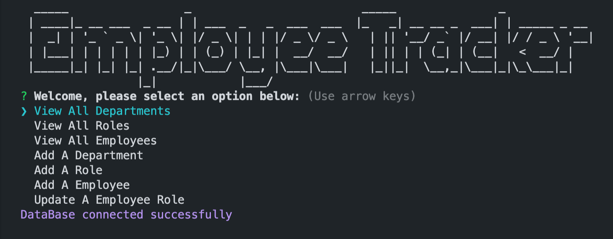

# Employer-Tracker

## Description
For this challenge we had to build a command-line application from scratch to manage a company's employee database, using Node.js, Inquirer, and MySQL. Working on this project I learned a little more on modularization along with setting up a sql connection.

## Image


## Table of Contents
* [Installation](#installation)
* [Exit-Application](#Exit-Application)
* [Issues](#issues)
* [Licenses](#licenses)
* [Deployed](#deployed)
* [Questions](#questions)
## Installation
Populate database by running mysql along with 
```
source schema.sql
```
```
source seeds.sql
```

install dependencies with 
``` 
npm install
```

run application with
```
node index.js
```
## Exit-Application
```
Control + C 
```
## Issues
Application not complete.
## Licenses
This project falls under the following license(s): 

* None
## Deployed
Deployed URL: [Github-Repo](https://github.com/Cesar-Infante/Employer-Tracker)

Live Demo: [App-Demo](https://drive.google.com/file/d/1yfFGroTyO_W8eTsqY6htaGp1W0cM_G6W/view)
## Questions
If you have any questions, please contact me below: 

Github: [Cesar-Infante](https://github.com/Cesar-Infante) 

Email: cesar261110@gmail.com